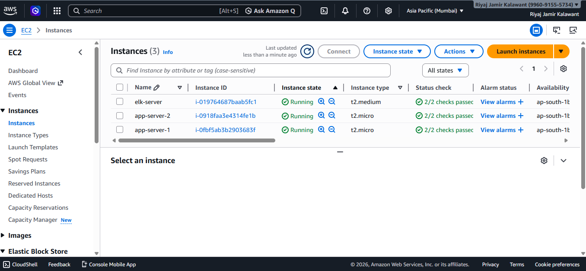
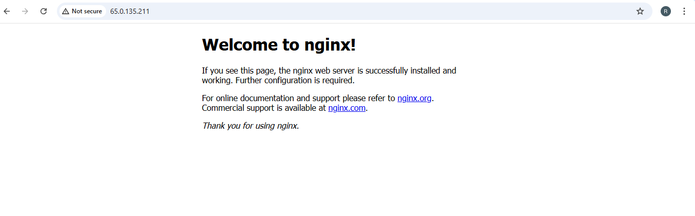
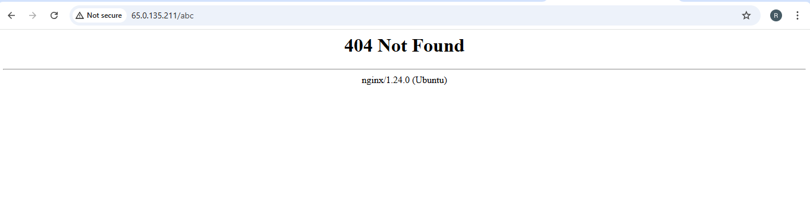
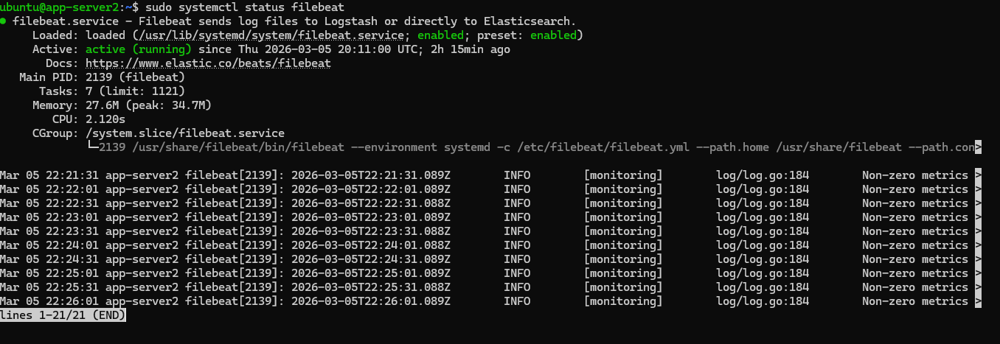
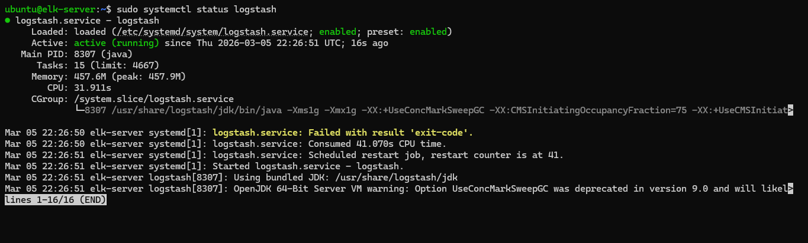
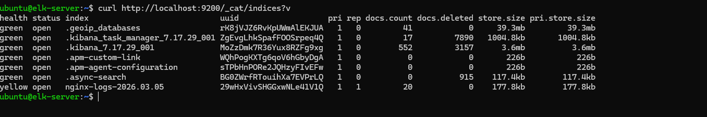
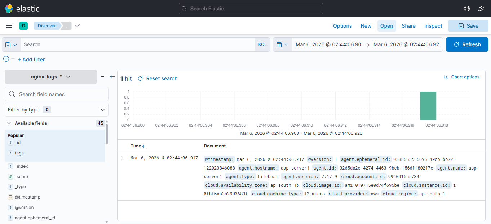
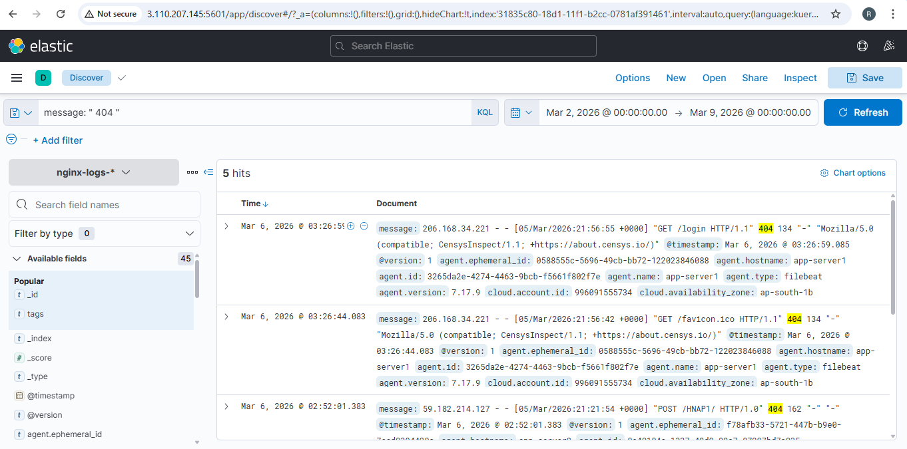

#  Centralized Log Aggregation and Monitoring using ELK Stack

##  Project Overview
This project demonstrates a **centralized logging system using the ELK Stack (Elasticsearch, Logstash, Kibana)**.

In traditional systems, logs are scattered across multiple servers, making troubleshooting difficult.  
This system collects logs from multiple servers, parses and stores them in Elasticsearch, and visualizes them in Kibana for easy monitoring.

Key benefits:

- Centralized logging
- Real-time error detection
- Faster troubleshooting
- Visual dashboards for monitoring

---

##  Architecture / Data Flow

App Server 1 (Nginx)
App Server 2 (Nginx)
↓
Filebeat
↓
Logstash
↓
Elasticsearch
↓
Kibana

- **App Servers:** Run Nginx to serve applications and generate logs  
- **Filebeat:** Collects logs and sends them to Logstash  
- **Logstash:** Parses, filters, and structures logs  
- **Elasticsearch:** Stores logs in indices for search and analysis  
- **Kibana:** Visualizes logs and creates dashboards/alerts

---

##  Technologies Used

- AWS EC2
- Nginx (Web Server)
- Filebeat (Log Forwarder)
- Logstash (Log Processor)
- Elasticsearch (Log Storage & Indexing)
- Kibana (Dashboard & Visualization)
- Ubuntu Linux 24.04 LTS
- KQL (Kibana Query Language for filtering)

---

##  Infrastructure Setup

### EC2 Instances

| Instance | Purpose |
|--------|--------|
| ELK Server | Elasticsearch + Logstash + Kibana |
| App Server 1 | Nginx + Filebeat |
| App Server 2 | Nginx + Filebeat |

---

##  Project Screenshots

### 1️ EC2 Instances

  
Shows all running instances in AWS console.

---

### 2️ Nginx Running in Browser

  
Default Nginx page on App Server.

---

### 3️ 404 Error in Browser

  
Shows manual 404 error generated to test ELK pipeline.

---

### 4️ Filebeat Running

  
Verifies Filebeat service is active and forwarding logs.

---

### 5️ Logstash Running

  
Shows Logstash service running and ready to parse logs.

---

### 6️ Elasticsearch Index Created

  
Confirms logs are stored in `nginx-logs-*` indices.

---

### 7️ Kibana Discover Logs

  
Visualizes logs collected from App Servers.

---

### 8️ Error Log Detection in Kibana

  
Shows **HTTP 404 logs filtered** using KQL in Kibana Discover.

---

##  Log Processing

Logstash parses incoming logs and applies filters:

- **4xx Errors**: `message: "404"`  
- **5xx Errors**: `message: "500"` (optional)  

Structured logs are stored in Elasticsearch indices for quick search and analysis.

---

##  Monitoring with Kibana

Kibana dashboards allow:

- Centralized log visualization  
- Real-time error detection  
- Monitoring of requests per minute  
- Identifying top client IPs  
- Configurable alerts for abnormal spikes

---

##  Project Outcome

- Centralized logging implemented  
- Logs collected from multiple servers  
- Logs parsed and indexed in Elasticsearch  
- Visualized logs in Kibana  
- Faster troubleshooting and proactive error detection

---

##  Author

**Riyaj Kalawant**  
DevOps Enthusiast | AWS | Docker | Kubernetes | CI/CD  
[LinkedIn](https://www.linkedin.com/in/riyajkalawant/) | [GitHub](https://github.com/Riyajkalawant)